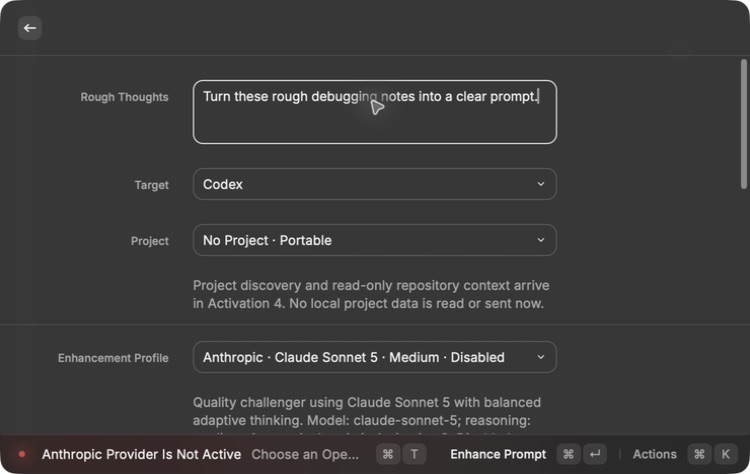
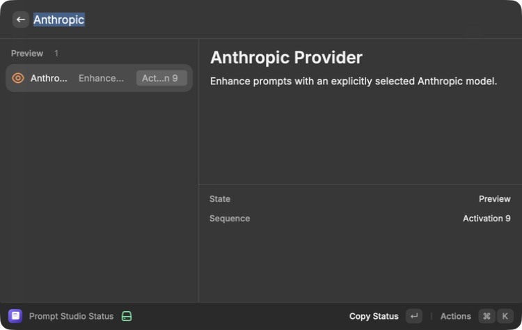
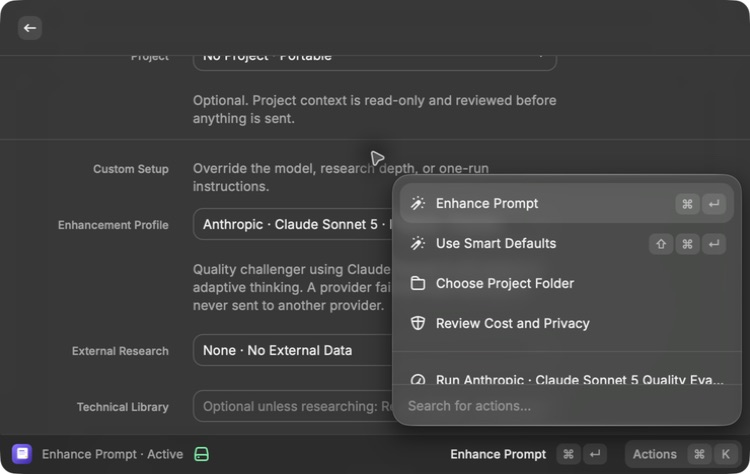
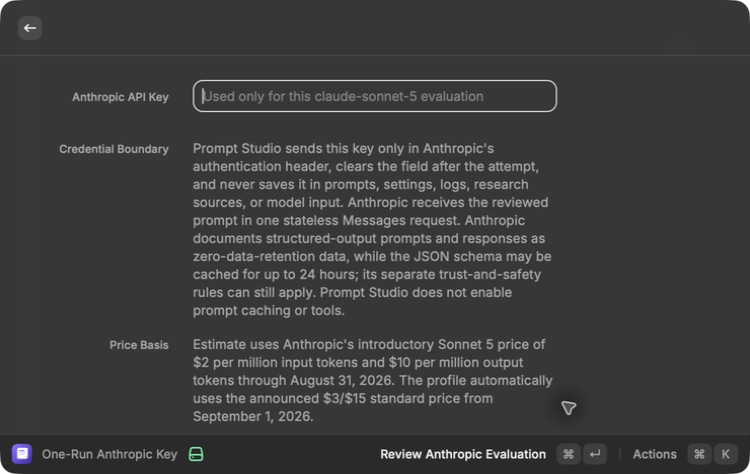

# Anthropic Provider — Activation 9 Implementation

Date: 2026-07-20  
State after this work: **Preview**

## Outcome

Prompt Studio now has a complete Anthropic enhancement path using Claude Sonnet 5. It is visible as a manual profile, shares the same compiler and local
validation as OpenAI, and cannot silently fall back to another provider.

The feature entered Preview because Activations 3–7 are Active and Activation 8
is intentionally skipped. Anthropic now uses the same frozen 24-case runner,
budget ceiling, private report, cancellation path, and blind human review as
OpenAI. It remains out of Active because no user-supplied Anthropic key is
available for the live comparison.

## Implemented boundary

- Native `POST https://api.anthropic.com/v1/messages`
- Fixed `anthropic-version: 2023-06-01`
- Exact model `claude-sonnet-5`
- Medium effort through `output_config.effort`
- Strict JSON schema through `output_config.format`
- One compiler pass with no tools, search, or prompt caching
- Masked one-run API-key form; the key is cleared after the attempt and is not
  persisted or included in model input
- Explicit refusal, output-limit, permission, rate-limit, service-outage,
  timeout, cancellation, malformed-output, and wrong-profile handling
- Returned usage and estimated cost recorded with cache categories when present
- Introductory $2/$10 input/output pricing through August 31, 2026, switching to
  the announced $3/$15 standard rate on September 1
- Full local result validation before preview or save

The provider-bound schema omits Anthropic-unsupported string-length keywords.
The original length, metadata, project-file, and source rules remain enforced
by Prompt Studio after the response.

## Privacy and fallback

The UI explains Anthropic's structured-output data boundary, including the
documented zero-data-retention treatment for prompts and responses and the
separate JSON-schema cache of up to 24 hours. No user or project content is
placed in the schema.

The Anthropic adapter rejects any non-Anthropic profile before a network call.
An Anthropic failure returns an Anthropic error and never sends the prompt to
OpenAI or Google.

## MacBook Pro rendered proof before Preview

The MacBook Pro Raycast form showed:

- `Anthropic · Claude Sonnet 5 · Medium · Disabled`
- Activation 9 state and the no-fallback statement
- the current price and privacy disclosure when selected
- submission stopping with
  `Anthropic Provider Is Not Active — Choose an OpenAI profile until Activation 9 passes.`

This happened before project collection, research planning, key entry, or
network access.

## MacBook Pro rendered proof in Preview

The current Raycast runtime now shows:

- Anthropic Provider as **Preview** in Prompt Studio Status;
- `Anthropic · Claude Sonnet 5 · Medium · Preview` as a manual profile;
- `Run Anthropic · Claude Sonnet 5 Quality Evaluation` in the Actions menu;
- a masked one-run key form labeled specifically for the evaluation; and
- the current credential boundary, privacy treatment, and introductory price
  before any key or model request.

No key was entered and no provider request was made.

The Mac Mini was used only as the clean SSH build-and-test mirror.

## Automated evidence

The shared suite covers:

- exact request body and headers without key leakage into the body
- the same provider-neutral evaluation path used by OpenAI and Google
- provider-compatible schema plus full local validation
- response parsing, provenance, cache-token accounting, and cost calculation
- missing key and wrong-profile rejection before transport
- HTTP 403 without retry
- HTTP 429 retry and recovery
- refusal, output limit, invalid output, timeout, and cancellation behavior
- no provider fallback

Final clean Mac Mini mirror results:

- 54/54 shared tests passed
- TypeScript completed with no errors
- ESLint completed with no issues
- Raycast production build completed successfully
- Prettier found every checked source, test, README, research, verification, and
  OpenSpec file correctly formatted
- strict OpenSpec validation passed
- Gitleaks scanned approximately 2.97 MB with redaction enabled and found no
  leaks

The no-key Anthropic dry run selected all 24 frozen cases: 10 development, 8
validation, and 6 protected. Its conservative token-cost ceiling is $2.02724,
shown as $2.03 in the Raycast confirmation. No provider request was made.

## Current-service recheck

The implementation was rechecked on July 20, 2026 against Anthropic's current
official documentation:

- [Claude Sonnet 5](https://platform.claude.com/docs/en/about-claude/models/whats-new-sonnet-5)
- [Effort](https://platform.claude.com/docs/en/build-with-claude/effort)
- [Structured outputs](https://platform.claude.com/docs/en/build-with-claude/structured-outputs)
- [Claude Platform release notes](https://platform.claude.com/docs/en/release-notes/overview)

The production contract still matches: `claude-sonnet-5`,
`output_config.effort: "medium"`, `output_config.format` JSON schema, one
Messages request, and no beta header. The current release notes still document
the introductory $2/$10 rate through August 31, 2026 and $3/$15 afterward. The
adapter sends neither removed manual-thinking controls nor unsupported sampling
overrides. No Anthropic key is currently available, so entering Preview did not
make a live or paid request.

## Remaining activation requirements

1. Activations 3–7 must remain Active, with Activation 8 recorded as
   intentionally skipped.
2. Enter a one-run Anthropic key and run the already authorized paid saved-case
   evaluation within the displayed maximum budget.
3. The frozen OpenAI, Anthropic, and Google cases must receive blind human
   review for quality, unsupported facts, latency, and cost.
4. Only then may Activation 9 move from Preview to Active with its own passing
   verification record.
