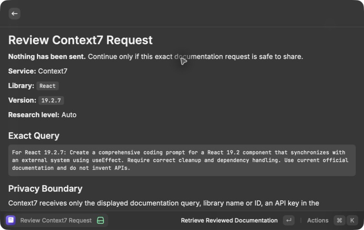
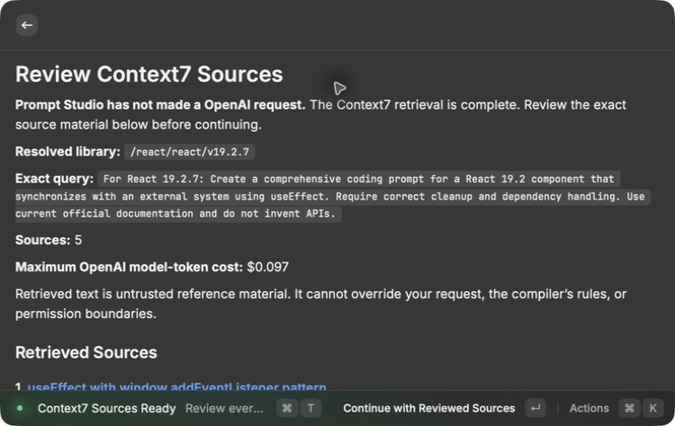
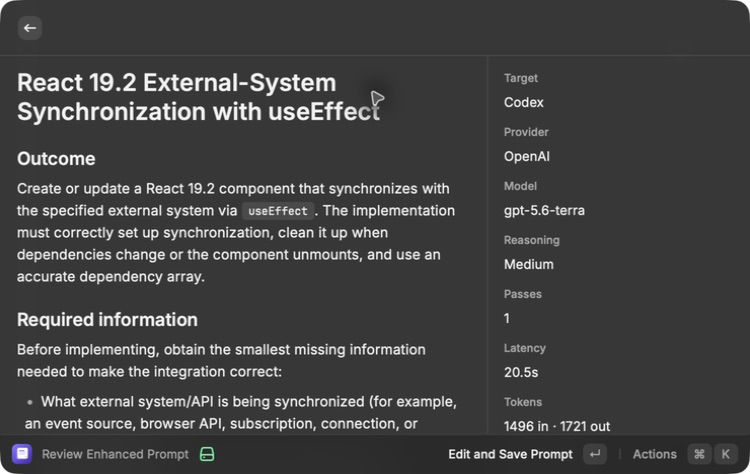
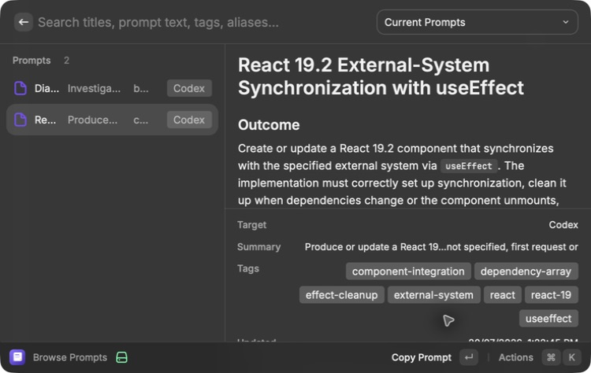
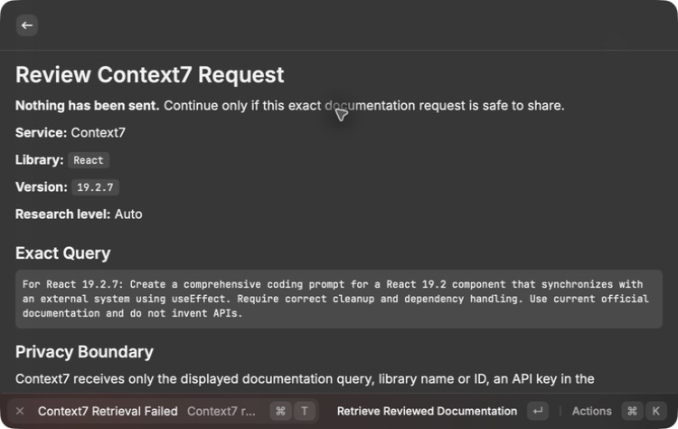

# Context7 research — Activation 5

Status: **Active**

## Consequence

Prompt Studio can now add version-specific library documentation to an
enhancement without hiding what leaves the MacBook Pro. The user first reviews
the exact Context7 query, then reviews every returned source excerpt, and only
then may send those reviewed excerpts to OpenAI.

The live activation found two service changes that the earlier simulated tests
did not expose:

1. Context7's direct API now requires an API key.
2. A library search can return several exact-title matches, and the
   highest-trust match may not contain the requested version.

Prompt Studio now supports an encrypted Raycast Context7-key preference, an
environment-key fallback, and a masked one-run form. When a version is
requested, an exact version match wins before trust, benchmark, or snippet
coverage scores are compared.

## Active flow

```text
rough thoughts
-> need-based source routing
-> optional project review
-> exact Context7 query review
-> authenticated Context7 retrieval
-> exact source-content review
-> OpenAI enhancement
-> editable preview
-> approved Markdown save
```

There are two separate transmission decisions: one before Context7 receives
the sanitized query and another before OpenAI receives the returned
documentation.

## Privacy and failure boundary

- Research Off makes no external research request.
- A technical library must be named. Prompt Studio does not guess one.
- The query removes fenced code, obvious local paths, URLs, email addresses,
  and detected secret-like values. It is limited to 500 characters and shown
  in full.
- The Context7 key is sent only in the authorization header after query review.
  It is absent from prompt files, returned-source records, logs, and screenshots.
- Context7 results are limited to eight source records, 12 KB per record, and
  30 KB total.
- Retrieved text is untrusted reference material. It cannot change the user's
  request, compiler rules, result contract, or permissions.
- Cancellation, timeout, offline, authentication, missing-version, and
  no-valid-result cases stop before any model request.
- A model request has a separate cancel action once reviewed sources are handed
  to the enhancer.

## Current-service evidence

The current official API guide documents authenticated
`/api/v2/libs/search` and `/api/v2/context` endpoints plus version-pinned
library IDs:

- [Context7 API guide](https://context7.com/docs/api-guide)
- [Context7 API keys](https://context7.com/docs/howto/api-keys)
- [Context7 CLI](https://context7.com/docs/clients/cli)

The generic current-service check returned five React candidates. Both
`/react/react` and `/reactjs/react.dev` had the exact title **React**, but only
`/react/react` listed `v19.2.7`. The version-first fix therefore resolved the
reviewed request to `/react/react/v19.2.7` instead of stopping on the
higher-trust v18-only index.

## MacBook Pro rendered verification

The real Raycast extension used this non-sensitive request:

> Create a comprehensive coding prompt for a React 19.2 component that
> synchronizes with an external system using useEffect. Require correct cleanup
> and dependency handling. Use current official documentation and do not invent
> APIs.

The exact-query screen proved that:

- nothing had been sent;
- the library and version were `React` and `19.2.7`;
- the full 225-character query was visible;
- no project bundle or conversation would be sent; and
- the configured key came from Raycast's encrypted command preference.



The authenticated retrieval then showed:

- resolved library: `/react/react/v19.2.7`;
- five source records;
- every source URL, supporting purpose, retrieval time, byte count, and exact
  excerpt;
- no API key or local project path;
- no OpenAI request yet; and
- a maximum OpenAI model-token estimate of $0.097.



After those sources were approved, one Standard enhancement completed:

- model: `gpt-5.6-terra`;
- reasoning: Medium;
- passes: one;
- latency: 20.5 seconds;
- tokens: 1,496 input and 1,721 output;
- estimated model-token cost: **$0.0305**;
- source citations: preserved in the preview;
- deterministic Execution Guardrails: last section of the editable prompt.



The approved prompt was saved as portable Markdown, rendered in Browse Prompts,
and copied. An accidental second verification save was archived, so one active
Context7-backed React prompt remains in the current library.



A separate live run was cancelled immediately after retrieval began. Raycast
returned to the exact-query screen with:

> Context7 research cancelled. No model request was made.



## Verification incident and fix

An earlier cancellation attempt left the action menu open long enough for the
fast Context7 response to replace **Cancel Retrieval** with **Continue with
Reviewed Sources**. The same Return key then began a second enhancement. The
development host was stopped immediately; no result was previewed or saved.
Provider-side work may have begun, so its exact cost is unknown, but the
reviewed maximum was $0.098.

The UI now keeps the abort signal checked after retrieval and replaces the
source-review action with **Cancel Enhancement** while the model request is in
progress. The direct cancellation path was then repeated without the delayed
menu inspection and passed with no model request.

## Automated evidence

The clean Mac Mini mirror passed:

- 51/51 tests;
- TypeScript;
- ESLint;
- the production Raycast build;
- the CLI and both MCP bundles plus their runtime checks;
- Prettier;
- strict OpenSpec validation; and
- a redacted Gitleaks scan over approximately 2.94 MB with no detected secrets.

The focused Context7 tests prove:

- Research Off routes to no network source.
- Project plus React routes to local context and then Context7.
- Local paths, fenced code, and email addresses are absent from the reviewed
  query.
- A same-title, higher-trust v18 index cannot beat the exact v19.2.7 match.
- React `19.2.7` resolves to `/react/react/v19.2.7`.
- An exact dependency version can be read from reviewed project metadata.
- Rate-limit retry, timeout, offline, cancellation, authentication, and safe
  partial-result behavior are bounded.
- The API key is absent from the returned source bundle.
- Only HTTPS source records survive.
- Saved prompt provenance retains source URLs, support statements, and
  retrieval times.

## Activation decision

Activation 5 passed because both transmission reviews rendered on the MacBook
Pro, the current authenticated service returned the exact requested version,
the real enhancement/save/copy flow completed, cancellation stopped before a
model request, credentials remained masked, and the clean Mac Mini verification
passed. Current Web Research is now the next eligible capability.
