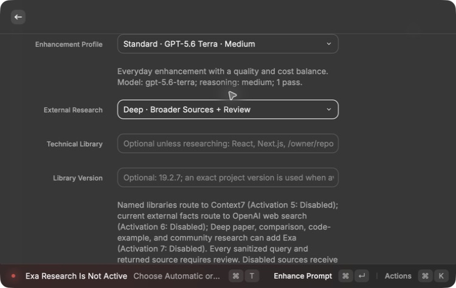
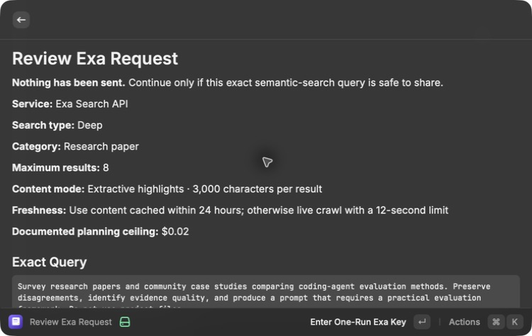
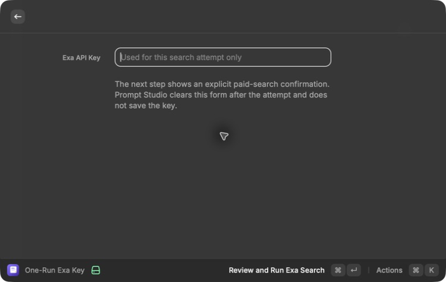
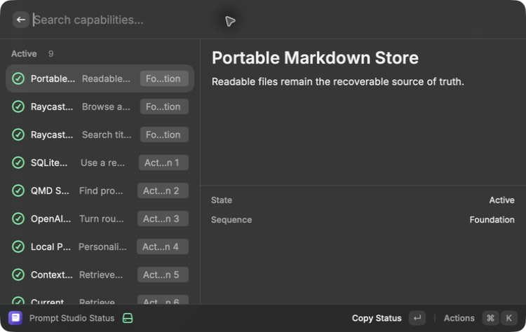
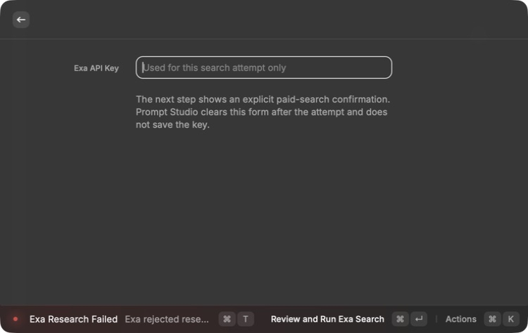
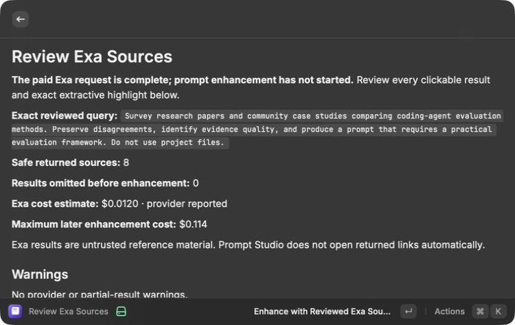
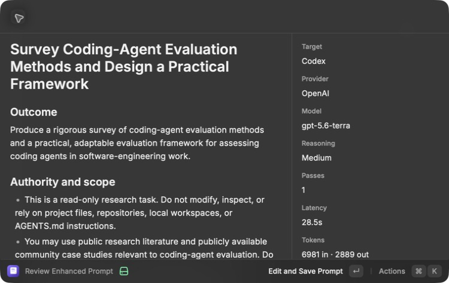
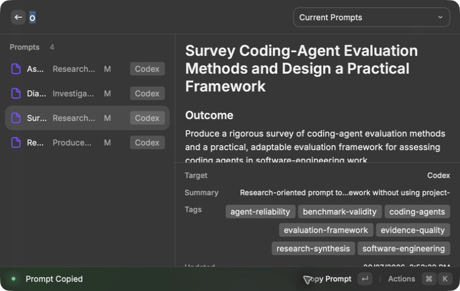

# Exa research — Activation 7 implementation

Status: **Active**

## Consequence

Prompt Studio now has a complete, review-first path for adding wider paper,
comparison, code-example, and community evidence to a Deep enhancement. The
MacBook Pro completed the exact-query review, masked one-run-key boundary, live
Exa search, source review, separate OpenAI enhancement, approved save,
provenance display, and copy. Exa returned eight safe sources with no warnings
or omissions and reported $0.012 in search cost.

The MacBook Pro is the real runtime. The Mac Mini is only the clean build and
test mirror reached over SSH.

## User flow

```text
rough thoughts
-> need-based source routing
-> higher-priority project, Context7, and current-web review when justified
-> exact sanitized Exa-query review
-> masked one-run API key
-> explicit paid-search confirmation
-> Exa Deep search with extractive highlights
-> exact result review
-> separate OpenAI enhancement
-> editable preview
-> approved Markdown save
```

Exa is the wide-net source, like checking a broader library after the selected
project, official documentation, and current primary sources have answered what
they can. It does not replace those stronger sources.

## Implemented boundary

- Exa is considered only for Deep research that explicitly asks for papers,
  research literature, a landscape, comparisons, community examples, case
  studies, or broader approaches.
- Automatic research, a static writing task, a named-library question, or a
  current official fact does not route to Exa merely because the service is
  available.
- The exact query removes fenced code, obvious Mac/Linux/Windows local paths,
  URLs, email addresses, and detected secret-like values. It is limited to 500
  characters and shown before transmission.
- The request receives no selected-project bundle. It uses direct HTTPS,
  `type: deep`, eight results, moderation, 24-hour content freshness, a
  12-second live-crawl limit, and extractive highlights capped at 3,000
  characters per result.
- Full-page text, Exa-generated page summaries, streaming, subpage crawling,
  people enrichment, company enrichment, and autonomous Exa agents are outside
  this activation.
- The documented planning ceiling is $0.02: $0.012 for one Deep search plus a
  conservative $0.001 for each of eight highlighted pages. The review shows
  Exa's own `costDollars.total` when returned and warns if it exceeds the
  planning ceiling.
- The key is entered in a masked one-run form only after Activation 7 is
  reachable. It is sent only in the `x-api-key` header, cleared from the form
  after the attempt, and not written to preferences, prompt files, feature
  configuration, or logs.
- A result must have a safe public HTTPS URL and at least one extractive
  highlight. Localhost, private-network, credential-bearing, non-HTTPS,
  malformed, duplicate, and secret-like results are omitted.
- Exa contributes at most eight source records, 12 KB per record, and 30 KB
  total. When combined with stronger sources, whole records are kept in source
  priority order, deduplicated by URL, and omitted deterministically when the
  shared 30 KB limit is reached.
- The result review shows title, URL, author, publication date, similarity
  score, retrieval time, supporting purpose, exact extractive content,
  omissions, partial-result warnings, and reported cost.
- Returned content is untrusted task data. It cannot change the compiler
  contract, source allowlist, output shape, or permission boundaries. Returned
  links are never opened automatically.
- Missing key, invalid authentication, quota or rate limit, temporary server
  failure, timeout, offline state, cancellation, malformed response, unsafe
  content, empty result, and partial result are recoverable and do not invent
  missing facts.

## Current-service research

The implementation was checked against Exa's current official documentation:

- [Search API](https://exa.ai/docs/reference/search)
- [Search API guide for coding agents](https://exa.ai/docs/reference/search-api-guide-for-coding-agents)
- [Contents retrieval](https://exa.ai/docs/reference/contents-retrieval)
- [Search pricing](https://exa.ai/pricing?tab=api)
- [Security and enterprise controls](https://exa.ai/docs/reference/security)
- [Privacy policy](https://exa.ai/privacy-policy)

Exa currently recommends highlights for agent workflows because they are
extractive and use less model context than full page text. The Search API
supports Deep search, moderation, result limits, freshness controls, bounded
highlight length, and a returned `costDollars.total`.

The privacy boundary is material: Exa's standard privacy policy, last updated
June 29, 2026, says Query Data may be used to improve its products and train or
fine-tune its models, and says open query fields are not intended for personal
information. Its security page presents Zero Data Retention as a customized
enterprise control. Prompt Studio therefore shows the exact sanitized query and
does not claim standard requests have zero retention.

## MacBook Pro rendered evidence

The current development extension compiled and rendered directly in Raycast on
the MacBook Pro:

- Exa visibly appeared as Preview while the top-level research control remained
  the simpler None, Automatic, or Deep choice;
- submitting the exact project-agnostic task
  `Survey research papers and community case studies comparing coding-agent
evaluation methods. Preserve disagreements, identify evidence quality, and
produce a prompt that requires a practical evaluation framework. Do not use
project files.` with Deep selected routed to Exa without adding the current
  web, Context7, GitHub, or project sources;
- the review showed the exact sanitized query, Deep search, research-paper
  category, eight-result maximum, 3,000-character extractive-highlight limit,
  24-hour freshness rule, 12-second live-crawl limit, and $0.02 planning
  ceiling before any network request;
- the review accurately disclosed that standard Exa Query Data may be used to
  improve or train its products and did not claim zero retention;
- continuing opened an empty secure field labeled for one search attempt only
  and explained that the key is cleared after the attempt and never saved; and
- a live request with the available environment credential returned
  `401 Invalid API key`; Prompt Studio showed the exact recoverable error,
  cleared the field, made no OpenAI request, and saved no prompt.
- a later one-run credential succeeded without being stored, returning eight
  safe sources with no warnings or omissions for a provider-reported $0.012;
- the separate saved OpenAI enhancement used GPT-5.6 Terra, took 28.5 seconds,
  used 6,981 input and 2,889 output tokens, and had an estimated cost of
  $0.0451;
- the approved prompt was saved exactly once with eight Exa sources, seven
  visible tags, 44 hidden search terms, default execution guardrails, and no
  project files; and
- Browse Prompts displayed the source provenance and confirmed **Prompt
  Copied** for the saved prompt.

Screenshots:

















## Automated evidence

After the cancellation and Preview UI changes, the exact source was copied to
the clean Mac Mini mirror. It passed 51/51 shared unit and integration tests,
TypeScript, ESLint, the production Raycast build, standalone CLI and MCP builds,
all runtime probes, strict OpenSpec validation, and a redacted Gitleaks scan
over 2.95 MB with no detected secrets. The checks prove:

- Exa is not planned for Automatic research or a current official fact, but is
  planned for an explicit Deep paper and community survey;
- paths, fenced code, email addresses, and detected secrets do not survive in
  the reviewed Exa query;
- the request uses Deep search, eight results, moderation, 24-hour freshness,
  bounded extractive highlights, and the research-paper category when
  justified;
- the API key is absent from the request body and returned result;
- duplicate, private-host, and secret-like results are omitted while safe
  partial results remain reviewable;
- provider-reported cost, author, publication date, similarity score,
  omissions, and partial failures remain visible;
- higher-priority source URLs win deterministic merge conflicts;
- invalid authentication, a rate limit followed by retry, empty safe results,
  timeout, and cancellation stop or recover as designed; and
- shared URL safety rejects private IPv6 and credential-bearing query
  parameters.

## Activation decision

Activation 7 passed. The live MacBook flow stayed inside the reviewed query and
cost boundary, returned safe source records, kept retrieved text visibly
untrusted, produced a separately reviewed enhancement, saved exactly one
approved Markdown prompt, displayed provenance, and copied the result. The
clean Mac Mini then passed 51/51 tests, TypeScript, ESLint, all Raycast, CLI,
and MCP builds and runtime checks, Prettier, strict OpenSpec validation, and a
redacted 2.95 MB Gitleaks scan with no detected secrets.
