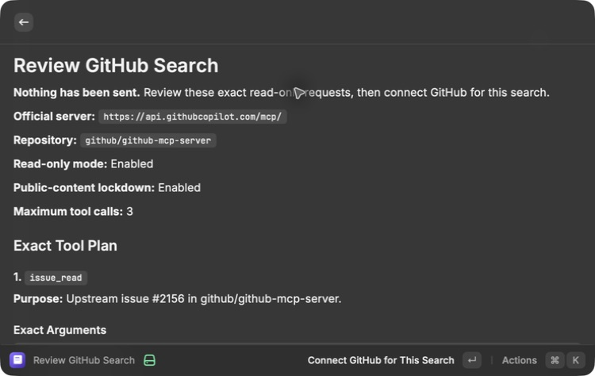
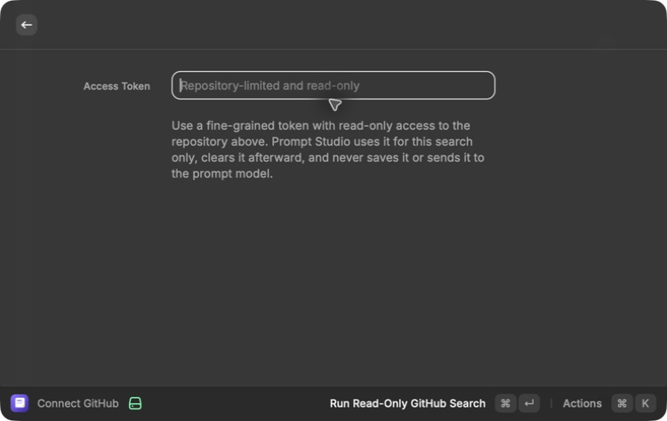
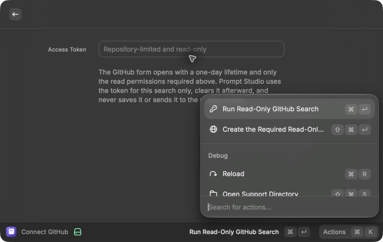
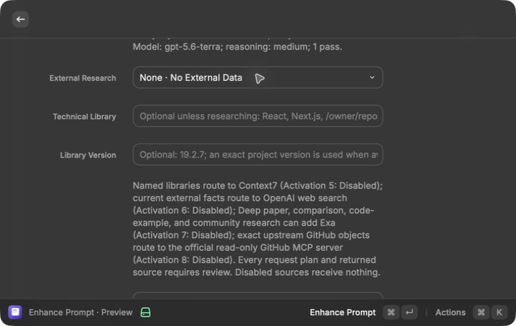
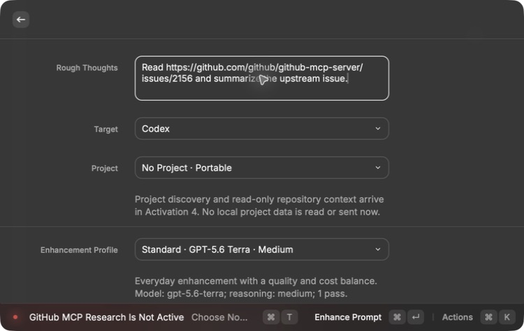
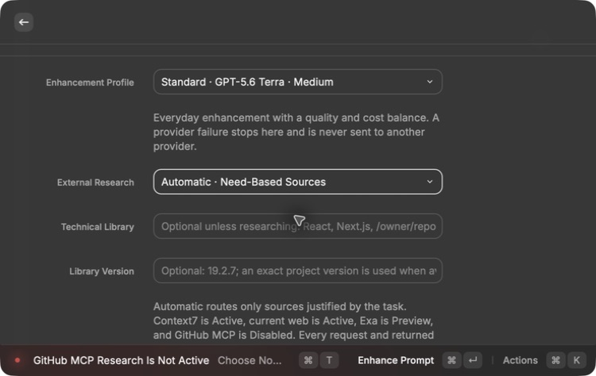
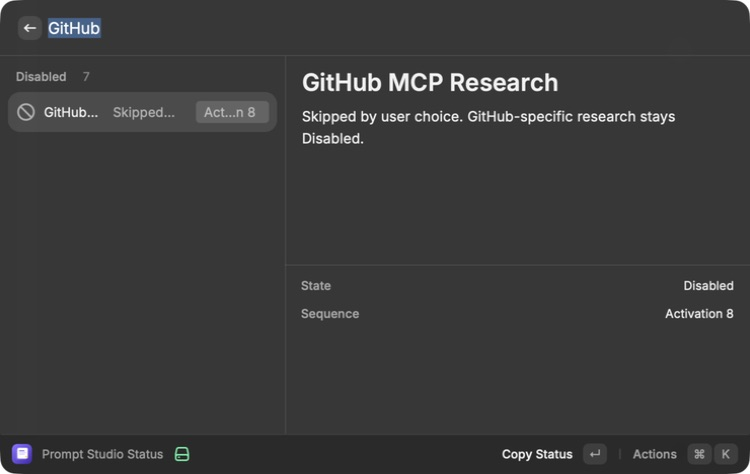

# GitHub MCP research — Activation 8 implementation

Status: **Disabled — intentionally skipped by user choice**

## Consequence

Prompt Studio retains its tested, review-first connection to GitHub's official
MCP server for future opt-in. Alex confirmed on July 20, 2026 that
GitHub-specific research is not needed, so the capability returned from Preview
to Disabled. It now performs no GitHub work, requests no token, and no longer
blocks Activation 9.

The MacBook Pro is the real runtime and rendered source of truth. The Mac Mini
is only the clean build and test mirror reached over SSH.

## User flow

```text
rough thoughts with exact owner/repository
-> need-based GitHub routing
-> deterministic read-tool plan
-> exact repository, tool, and argument review
-> masked one-run fine-grained token
-> explicit connection confirmation
-> official server initialization and tool-list check
-> at most three allowlisted read calls
-> exact bounded source review
-> separate OpenAI enhancement
-> editable preview
-> approved Markdown save
```

The double allowlist works like checking both a venue's guest list and a
visitor's bag: GitHub is told to expose only the planned read tools, and Prompt
Studio independently stops if the returned tool list contains anything else.

## Implemented boundary

- GitHub is considered only when Automatic or Deep research finds an explicit
  GitHub URL, upstream GitHub object, or issue or pull-request reference.
- The planner requires an exact `owner/repository` or `github.com` repository
  URL. It never guesses a remote repository from project prose.
- Planning is deterministic rather than delegated to a model. It supports
  bounded reads for repository paths and README documentation, code search,
  commits, latest or tagged releases, issues, pull requests, recent Actions
  runs, pull-request checks, and the final 200 lines from failed jobs in an
  exact workflow run.
- At most three GitHub tools can be planned. List and search operations request
  no more than ten records. Commits omit patch content. Job logs require an
  exact run identifier, use `failed_only`, and cap the returned tail.
- The production endpoint is fixed to
  `https://api.githubcopilot.com/mcp/`. A non-official endpoint is accepted only
  when a test-provided network adapter is also present, so a real one-run token
  cannot be redirected by a changed plan.
- The client uses the stable MCP `2025-11-25` initialization lifecycle, accepts
  the compatible `2025-06-18` revision if the server negotiates it, sends the
  initialized notification, carries the returned session identifier, adds the
  negotiated protocol header, handles JSON and server-sent event responses,
  and makes a best-effort session close.
- Every connection requests `X-MCP-Readonly: true`,
  `X-MCP-Lockdown: true`, and `X-MCP-Tools` containing only the planned tools.
  Prompt Studio then verifies `tools/list`. Any unexpected or required-missing
  tool stops the run before `tools/call`.
- The client contains no write-tool name in its allowlist. It cannot call issue
  writes, pull-request writes, merges, workflow triggers, file changes, branch
  creation, releases, reviews, reactions, or comments.
- The token is entered in a masked one-run form after the plan review. It is
  sent only in the `Authorization` header, cleared after the attempt, and never
  written to preferences, feature state, prompts, logs, research content, or
  OpenAI input.
- The token-creation action uses GitHub's documented URL template to prefill a
  one-day expiration plus only Metadata and the Contents, Issues, Pull
  requests, or Actions read permissions required by the reviewed tools. It
  never preselects write access.
- GitHub receives repository and object identifiers, refs, paths, exact tool
  arguments, authentication, and connection metadata. It does not receive the
  rough prompt, selected-project bundle, Context7 text, web or Exa results, or
  later enhancement request.
- Returned content is prefixed as untrusted reference data. Text embedded in a
  repository, issue, pull request, release, or job log cannot expand the tool
  list, grant authority, trigger a GitHub write, reveal the token, or override
  compiler rules.
- Control characters and detected secret-like values are rejected. Each source
  is limited to 12 KB, the GitHub stage is limited to 30 KB total, and the
  shared source merge remains deterministic and URL-deduplicated. Protocol
  responses are streamed into a separate 512 KB safety limit so a legitimate
  GitHub response is never cut in the middle of JSON; anything larger stops
  before enhancement.
- The result review records server name and version when supplied, negotiated
  protocol, repository, exact tool calls and arguments, source URL, retrieval
  time, purpose, exact content, inclusion status, and warnings.
- Missing authentication, permission denial, GitHub organization policy,
  rate limits, service failure, network outage, timeout, cancellation, invalid
  protocol, malformed response, unexpected tools, tool error, unsafe content,
  and empty safe output stop before enhancement with a recoverable message.

## Current-service research

The implementation was rechecked on July 20, 2026 against the official server
at commit
[`1338dbed`](https://github.com/github/github-mcp-server/tree/1338dbed4a044ee26422d4212bac3a8037fdb7ff)
and the current MCP specification:

- [Official GitHub MCP server](https://github.com/github/github-mcp-server)
- [Server configuration guide](https://github.com/github/github-mcp-server/blob/main/docs/server-configuration.md)
- [Remote server guide](https://github.com/github/github-mcp-server/blob/main/docs/remote-server.md)
- [GitHub setup documentation](https://docs.github.com/en/copilot/how-tos/provide-context/use-mcp-in-your-ide/set-up-the-github-mcp-server)
- [MCP 2025-11-25 lifecycle](https://modelcontextprotocol.io/specification/2025-11-25/basic/lifecycle)
- [MCP Streamable HTTP transport](https://modelcontextprotocol.io/specification/2025-06-18/basic/transports)
- [Fine-grained personal access tokens](https://docs.github.com/en/authentication/keeping-your-account-and-data-secure/managing-your-personal-access-tokens)
- [GitHub REST API rate limits](https://docs.github.com/en/rest/using-the-rest-api/rate-limits-for-the-rest-api)

GitHub's current configuration guide supports individual tools through
`X-MCP-Tools`, read-only mode through `X-MCP-Readonly`, and public-content
lockdown through `X-MCP-Lockdown`. It says read-only mode takes precedence over
explicit tool requests. Prompt Studio still verifies the offered list because
defense in depth does not depend on a single remote switch.

The current server schemas still identify the exact read tools and arguments
used by Prompt Studio, including
`get_file_contents`, `search_code`, `get_commit`, `get_latest_release`,
`get_release_by_tag`, `issue_read`, `pull_request_read`, `actions_list`, and
`get_job_logs`. No planned name or argument has drifted. Prompt Studio uses only
the smallest subset justified by the displayed plan.

GitHub recommends minimal repository access and permissions for fine-grained
personal access tokens. Prompt Studio links to that token form and does not
promise that every organization permits personal tokens. Organization policy
or missing read permissions produce a visible denial. GitHub's documented rate
limits also apply; Prompt Studio does not automatically retry a rate-limited
GitHub read.

GitHub also documents token-creation URL parameters for name, description,
expiration, and individual permissions. Prompt Studio now derives that URL from
the exact reviewed tool plan instead of leaving the user to translate tool
names into GitHub permission labels.

GitHub does not publish a separate per-call price for the remote MCP server, so
the confirmation does not invent a dollar estimate. It instead displays the
call count and says normal account, repository, and API limits apply.

## Live background protocol evidence

The official endpoint rejected an unauthenticated initialization request with
HTTP 401 and `missing required Authorization header`. Public-repository access
therefore still requires GitHub authentication.

Prompt Studio then made one reviewed public read from
`github/github-mcp-server` through the fixed official endpoint. The call:

- negotiated MCP `2025-11-25` with the official `github-mcp-server`;
- requested only `get_file_contents` for `README.md`;
- sent read-only, public-content lockdown, and exact-tool headers;
- returned one 12,000-byte bounded source containing the requested README text;
- prefixed it as untrusted GitHub reference data;
- recorded the repository, exact arguments, source URL, retrieval time, server
  version, and tool call; and
- returned no warnings.

The probe used an existing GitHub CLI login from the macOS keychain. The token
value never appeared in a command argument, output, source record, file, model
input, or prompt. Because that login has broader OAuth permissions than the
recommended fine-grained, repository-limited token, this probe proves the live
protocol but is not being treated as the final least-privilege Raycast
verification.

The first live response also exposed a Preview defect: GitHub now returns file
contents as an MCP embedded resource inside a streamed response larger than the
old raw-message limit. Prompt Studio cut that JSON before parsing and ignored
the embedded resource type. The client now reads the complete response inside
the 512 KB protocol limit, extracts text resources, and still trims the source
given to enhancement to 12 KB.

## MacBook Pro rendered evidence

The current development extension compiled and rendered directly in Raycast on
the MacBook Pro:

- the simplified enhancement form kept GitHub controls hidden until Customize
  was requested;
- during its Preview evaluation, Automatic research visibly identified GitHub
  MCP as Preview;
- submitting
  `Read https://github.com/github/github-mcp-server/issues/2156 and summarize
the upstream issue. Do not use project files.` produced an exact review for
  repository `github/github-mcp-server`, one read-only `issue_read` request, and
  issue `2156`;
- the review visibly showed the official endpoint, read-only mode,
  public-content lockdown, exact arguments, three-call ceiling, privacy
  boundary, and normal GitHub limit disclosure;
- the primary action used the plain-language label
  `Connect GitHub for This Search`;
- the connection form rendered one masked `Access Token` field, a
  repository-limited read-only placeholder, a short one-run privacy
  explanation, and a `Create the Required Read-Only Token` action;
- the action panel explained that GitHub's form would receive a one-day
  expiration and only the read permissions required for that exact plan;
- Escape cancelled before any credential, network request, OpenAI request,
  prompt save, overlap, blank view, or unusable control; and
- Raycast returned cleanly to its command search afterward.

Screenshots:







Historical Disabled-state evidence retained from before Preview:







## Automated evidence

The current clean Mac Mini mirror passed 54/54 shared unit and integration
tests, TypeScript, ESLint, the production Raycast build, standalone CLI and MCP
builds, all runtime probes, strict OpenSpec validation, and a redacted Gitleaks
scan over 2.97 MB with no detected secrets after the service-contract and
cancellation audit.

The current checks prove:

- punctuation immediately after pasted GitHub URLs does not corrupt repository
  or issue parsing;
- the token-template URL grants only read permissions, expires after one day,
  and selects Issues, Contents, or Actions only when the reviewed tools need
  them;
- an exact issue, latest release, and Actions request becomes exactly three
  bounded read calls, while an absent repository is never guessed;
- the initialize, initialized, tool-list, tool-call, and session-close
  lifecycle carries the negotiated protocol and session headers;
- read-only, lockdown, and exact-tool headers are present before connection;
- live-style streamed file resources larger than the old raw-message limit are
  parsed without cutting JSON, while source and protocol size limits remain
  enforced;
- a server that exposes `issue_write` alongside the planned `issue_read` is
  rejected before any tool call;
- the token stays in the authentication header and never enters a tool argument,
  source record, or result;
- prompt-injection text remains visibly labeled as untrusted data and cannot
  produce a write call; and
- missing authentication, permission denial, rate limit, service failure,
  network outage, and cancellation stop as designed.

The Raycast path now also exposes cancellation from the masked token form,
checks cancellation once more after retrieval before opening a source review,
and exposes cancellation while the separate prompt enhancement is running.
Cancellation never saves a prompt.

## Current skipped-state proof

The MacBook Pro Prompt Studio Status surface shows GitHub MCP Research as
**Disabled** with the explicit explanation: “Skipped by user choice.
GitHub-specific research stays Disabled.”



## Skip decision

1. GitHub-specific research is not required for the current product.
2. No further live token, read, save, or copy verification is required while
   the capability remains Disabled.
3. The implementation and earlier evidence remain available for a future
   explicit opt-in.
4. Disabled means no GitHub network request, credential request, background
   work, or data mutation.
