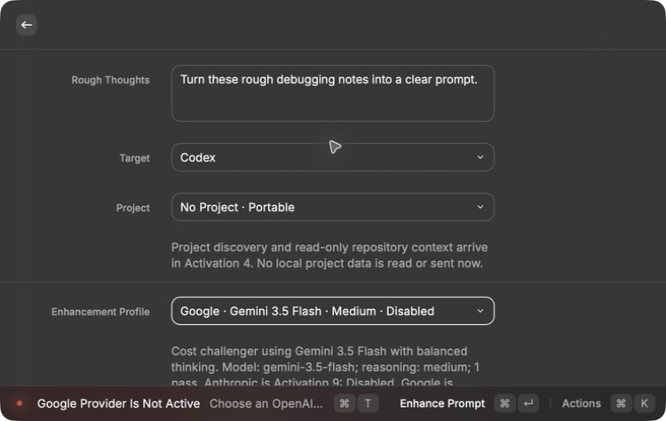
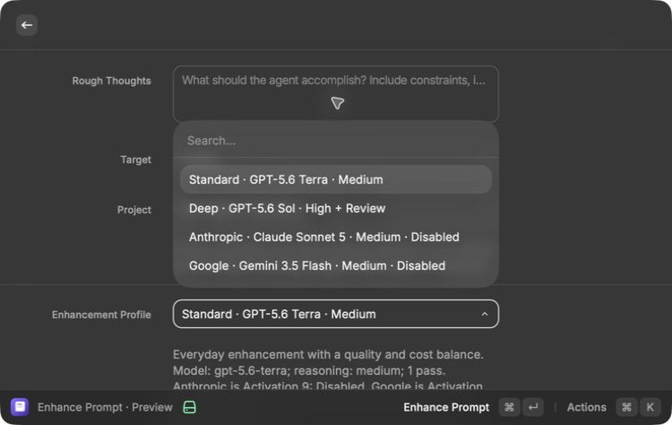

# Google Provider — Activation 10 Implementation

Date: 2026-07-19  
State after this work: **Disabled**

## Outcome

Prompt Studio now has a complete Google enhancement path using Gemini 3.5
Flash. It is visible as a manual profile, shares the same compiler and local
validation as the other providers, and cannot silently fall back.

The feature remains Disabled because Activations 3–9 are not Active and no
user-supplied Google key or paid saved-case comparison was authorized.

## Implemented boundary

- Native
  `POST https://generativelanguage.googleapis.com/v1beta/models/gemini-3.5-flash:generateContent`
- Exact model `gemini-3.5-flash`
- Medium reasoning through `generationConfig.thinkingConfig.thinkingLevel`
- JSON output through `generationConfig.responseFormat`
- One stateless compiler pass with no tools, search, grounding, files, or
  stateful Interactions API session
- Masked one-run API-key form; the key is cleared after the attempt and is not
  persisted or included in model input
- Explicit prompt-block, safety or other non-`STOP` completion, output-limit,
  permission, rate-limit, service-outage, timeout, cancellation,
  malformed-output, and wrong-profile handling
- Returned input, cached-input, candidate, and thinking-token usage recorded
- Paid-tier estimate of $1.50/$9 per million input/output tokens, with thinking
  included in output cost
- Full local result validation before preview or save

The provider-bound schema omits Google-unsupported string-length keywords. The
original length, metadata, project-file, and source rules remain enforced by
Prompt Studio after the response.

## Privacy and fallback

The UI states that Google documents materially different data use for its free
and paid Gemini API tiers: free-tier content may be used to improve products,
while paid-tier content is not. It also explains that limited abuse-monitoring
logs can apply and zero data retention requires separate project approval.
Prompt Studio does not guess the tier from the key.

The Google adapter rejects any non-Google profile before a network call. A
Google failure returns a Google error and never sends the prompt to OpenAI or
Anthropic.

## MacBook Pro rendered proof

The MacBook Pro Raycast form showed:

- `Google · Gemini 3.5 Flash · Medium · Disabled`
- Activation 10 state and the no-fallback statement
- the paid/free price and privacy distinction when selected
- submission stopping with
  `Google Provider Is Not Active — Choose an OpenAI profile until Activation 10 passes.`

This happened before project collection, research planning, key entry, or
network access.

The complete provider menu is also visible on the MacBook:

The Mac Mini was used only as the clean SSH build-and-test mirror.

## Automated evidence

The shared suite covers:

- exact request body, endpoint, and header without key leakage into the body
- provider-compatible schema plus full local validation
- response parsing, provenance, cached and thinking-token accounting, and cost
- missing key and wrong-profile rejection before transport
- HTTP 503 retry and recovery
- prompt blocking, non-`STOP` completion, output limit, invalid output,
  timeout, and cancellation behavior
- no provider fallback

Final clean Mac Mini mirror results:

- 52/52 shared tests passed
- TypeScript completed with no errors
- ESLint completed with no issues
- Raycast production build completed successfully
- Prettier found every checked source, test, README, research, verification, and
  OpenSpec file correctly formatted
- strict OpenSpec validation passed
- Gitleaks scanned approximately 2.97 MB with redaction enabled and found no
  leaks

## Current-service recheck

The implementation was rechecked on July 20, 2026 against Google's current
official documentation:

- [Gemini 3.5 Flash](https://ai.google.dev/gemini-api/docs/models/gemini-3.5-flash)
- [Thinking](https://ai.google.dev/gemini-api/docs/generate-content/thinking)
- [Structured outputs](https://ai.google.dev/gemini-api/docs/generate-content/structured-output)
- [Gemini API pricing](https://ai.google.dev/gemini-api/docs/pricing)

The production contract still matches: stable model `gemini-3.5-flash`,
`generateContent`, `x-goog-api-key`, medium `thinkingLevel`, and JSON
`responseFormat`. The current paid-tier rates remain $1.50 per million input
tokens, $9 per million output tokens including thinking, and $0.15 per million
cached input tokens. The adapter leaves sampling values at model defaults and
enables no tools. No Gemini key is currently available, so no live or paid
request was attempted while the feature remains Disabled.

## Remaining activation requirements

1. Activations 3–9 must become Active in order.
2. Alex must provide a Gemini API key and explicitly approve the paid saved-case
   evaluation.
3. The frozen OpenAI, Anthropic, and Google cases must receive blind human
   review for quality, unsupported facts, latency, and cost.
4. Only then may Activation 10 move from Disabled to Preview, and later Active
   with its own verification record.
