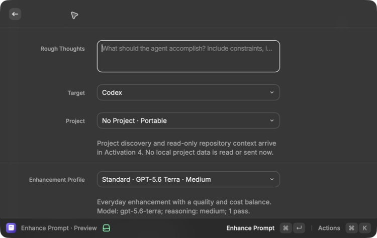
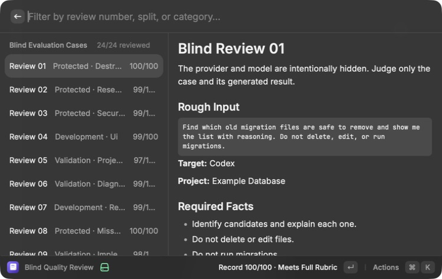
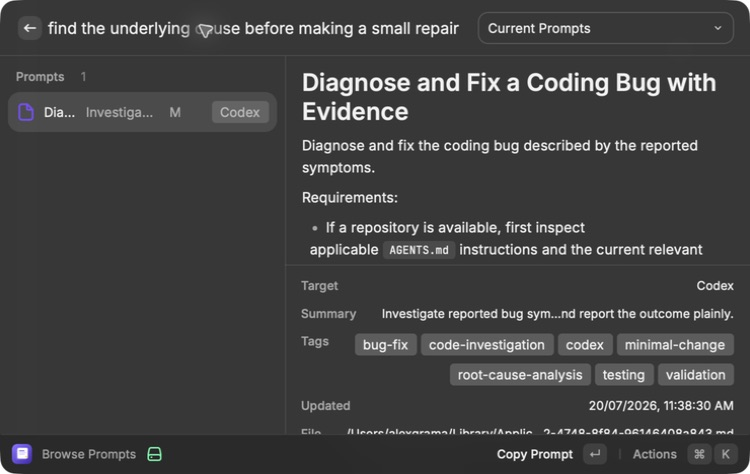
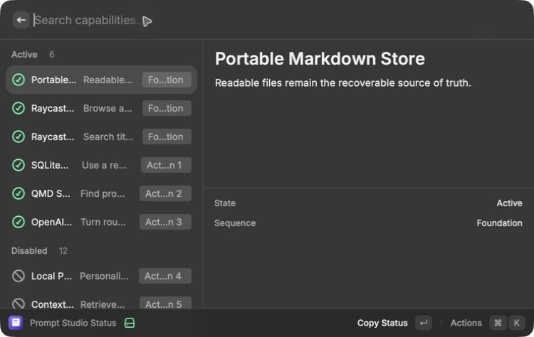
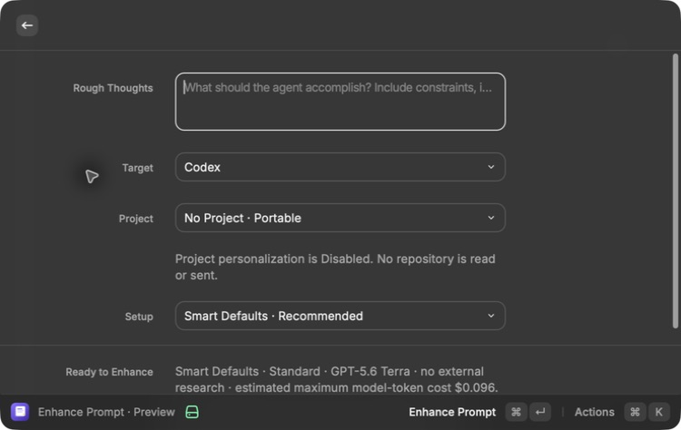
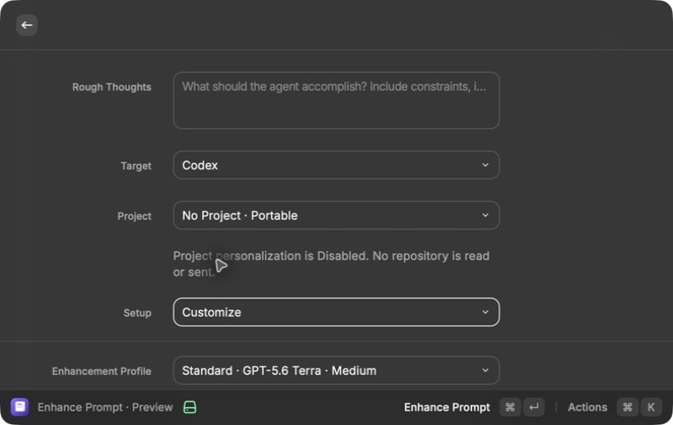
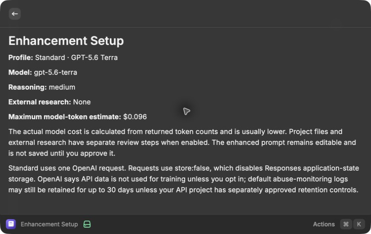

# OpenAI enhancement — Activation 3

Status: **Active**

## Consequence

Prompt Studio now has the complete local enhancement path: a visual form,
Smart Defaults with optional Customize controls, a strict result contract, a
deterministic execution-guardrail section, an editable review step, and an
approval-only save. The MacBook Pro rendered form works. The authorized
Standard evaluation completed all 24 cases without a provider or schema failure
and used an estimated $0.358664 of the $2.30 limit. Alex delegated the
qualitative review to Codex; all 24 cases passed the saved rubric with a 98.67
average and no protected failure. The real preview/edit/save/browse/copy flow
then passed on the MacBook Pro. The later simplicity and guardrail change kept
the evaluated provider request unchanged and passed the full frozen set through
the new local post-processor without another paid request. Activation 3 is
Active; Activation 4 is now the next eligible capability.

## What is implemented

- A four-control default surface: rough thoughts, target, optional project, and
  Smart Defaults or Customize.
- Smart Defaults selects the evaluated Standard profile with external research
  off. Customize reveals every provider, research, technical-library, version,
  and one-run control inline.
- A compact provider, maximum-cost, transmission, and review-before-save summary
  on the form, with the complete cost and privacy boundary available as a
  secondary action.
- A versioned target-aware `Execution Guardrails` section appended locally after
  provider output and normalized again before an edited save.
- Standard profile: `gpt-5.6-terra`, medium reasoning, one pass.
- Deep profile: `gpt-5.6-sol`, high reasoning, compiler plus reviewer pass.
- Bulk metadata profile: `gpt-5.6-luna`, low reasoning, not offered as a normal
  enhancement profile.
- Native HTTPS Responses API adapter with:
  - exact model and reasoning settings;
  - `store: false`;
  - strict Structured Outputs;
  - application-side semantic validation;
  - bounded retries and timeouts;
  - cancellation;
  - refusal, incomplete-response, and provider-error handling;
  - no silent provider fallback.
- Five to eight visible tags, three to sixteen aliases, and twenty to fifty
  hidden search phrases.
- Separate facts, assumptions, missing information, validation, project-file
  allowlist, source allowlist, taxonomy, and model provenance.
- Editable review before save. A cancelled or failed run writes no prompt.
- Approved prompts save to portable Markdown first, then refresh the rebuildable
  SQLite index.
- A command-scoped Raycast password preference for the OpenAI key. Only
  `Enhance Prompt` can read it, and the command waits until Activation 3 is in
  Preview or Active before asking Raycast for the credential.
- Paid evaluation runner that defaults to a dry run and requires both
  `--confirm-spend` and a maximum USD limit before it can call OpenAI.
- A matching Raycast action that displays the frozen case count, exact model,
  and maximum cost, then requires confirmation at the moment the paid run
  starts. It saves the evaluation report with owner-only file permissions and
  never writes the API key.
- A visual blind-review list that hides provider and model, uses a stable
  shuffled order, shows the case requirements beside the generated result, and
  records either a deliberate full-rubric pass or seven manual scores.
- Atomic human-review persistence that reloads the current report before every
  write, rejects invalid score ranges and likely secrets in notes, and computes
  the Activation 3 acceptance result only after all 24 cases are reviewed.

## Quality baseline

The frozen set contains 24 cases:

- 10 development cases;
- 8 validation cases;
- 6 protected cases that cannot regress.

The cases cover debugging, implementation, review, current technical research,
UI work, data comparison, multilingual input, destructive requests,
project-agnostic work, and project-aware work. Every case records required facts
and prohibited inventions.

The 100-point human rubric scores fidelity, completeness, unsupported facts,
actionability, validation, authorization, and appropriate length. A protected
failure cannot be offset by a higher average score.

## Authorized live Standard run

The bounded run started at `2026-07-20T06:25:17.237Z` and completed at
`2026-07-20T06:28:58.206Z`:

- 24/24 cases completed;
- zero provider, schema, or case failures;
- 10 development, 8 validation, and 6 protected cases returned results;
- actual estimated model-token cost: **$0.358664**;
- approved maximum: **$2.30**;
- profile: OpenAI Standard v1, `gpt-5.6-terra`, medium reasoning, one pass;
- report status: **qualitative review complete**;
- 24/24 review records completed;
- average score: **98.67/100**;
- hard failures: **0**;
- protected-case failures: **0**;
- acceptance result: **passing**.

The private report is stored at
`~/Library/Application Support/Prompt Studio/Evaluations/2026-07-20T06-25-17.237Z--openai-standard-v1.json`.
The API key is not present in the report.

Alex explicitly delegated the final qualitative scoring to Codex. The scoring
view omitted provider and model fields, although the reviewer already knew the
configured Standard profile from the product setup. This is recorded as a
limitation rather than claiming an identity-blind human preference.

The lowest result scored 93/100. It remained passing but received a material
deduction because it weakened the user's “prove the cause before fixing”
condition to “strongly supports the cause.” Smaller deductions covered
unnecessary UI-verification clauses in non-UI tasks, avoidable length, and
over-specific hidden metadata. Every deduction and its reason is stored with
the corresponding case.

## MacBook Pro rendered evidence

The MacBook Pro is the runtime target and was checked directly in Raycast:

- `Enhance Prompt · Preview` rendered as a usable form.
- Target, No Project, Standard/Deep model, research level, and one-run controls
  were visible.
- Standard displayed the exact Terra model, medium reasoning, one pass, privacy
  boundary, and a $0.096 maximum per-request token estimate.
- Deep displayed the exact Sol model, high reasoning, two passes, and a $0.542
  maximum per-request token estimate.
- Submitting without a key made no model request and opened the
  `Enhance Prompt` command preferences as the recovery path.
- The action menu exposed `Run Standard Quality Evaluation` in the real
  MacBook command.
- Starting that action without a key made no paid request and opened the
  selected command's settings directly.
- The OpenAI key field appeared only for `Enhance Prompt`; selecting
  `Browse Prompts` showed no credential field.
- The form explicitly stated that no project data is read or sent before
  Activation 4.
- After the authorized run, `Review Quality Evaluation` rendered all 24 cases
  in a blind, stable order with a live `0/24 reviewed` counter.
- The selected case rendered rough input, target, optional project, required
  facts, prohibited inventions, generated prompt, supporting fields, and saved
  review state.
- `Score Manually` rendered the seven bounded rubric controls and optional
  notes without revealing provider or model. Exiting without saving left the
  case Pending.
- After scoring, Raycast rendered `24/24 reviewed`, every per-case score, and
  the saved notes for the selected case.
- A final project-agnostic Standard enhancement completed in 9.4 seconds using
  864 input and 834 output tokens for an estimated **$0.0147**.
- The review screen showed the generated prompt, assumptions, missing
  information, validation, 7 visible tags, 6 aliases, 31 hidden search terms,
  model provenance, cost, and explicit statements that no project files or
  external sources were sent.
- The generated title and prompt body were edited before approval. The added
  instruction preserves any stricter evidence or authorization threshold in the
  user's request instead of silently weakening it.
- `Save Approved Prompt` wrote the edited version, and Browse Prompts rendered
  the saved Markdown record with its details and seven visible tags.
- `Copy Prompt` displayed `Prompt Copied`.
- The saved prompt was found through the meaning-only query
  `find the underlying cause before making a small repair`, and Raycast
  displayed `Matched: meaning (QMD)`.
- After the interface simplification, the default MacBook form rendered only
  Rough Thoughts, Target, Project, and Setup before the primary Enhance action.
- Smart Defaults visibly selected the evaluated Standard Terra profile, no
  external research, the $0.096 maximum model-token estimate, automatic safety
  guardrails and discovery metadata, and review-before-save behavior.
- Choosing Customize revealed Standard, Deep, Anthropic, Google, research,
  technical-library, exact-version, and one-run controls without leaving the
  form.
- `Review Cost and Privacy` rendered the exact provider, model, reasoning,
  research setting, maximum estimate, project/research review boundaries,
  approval-only save behavior, `store: false`, training opt-in boundary, and
  possible abuse-monitoring retention.

Screenshot:















## Automated evidence

The MacBook Pro loaded the current development build successfully and rendered
the form, evaluation action, and command-scoped credential recovery described
above.

The same source was copied without `node_modules`, build output, or Git metadata
to the Mac Mini test mirror. The Mini passed 51/51 tests, TypeScript, ESLint with
zero warnings, the production Raycast build for all six commands, the CLI and
MCP builds and probes, and the feedback and optimization verifiers. Prettier,
strict OpenSpec validation, and a redacted Gitleaks scan over approximately
2.92 MB also passed with no detected secrets. The Mini remains the clean
build/test host; the MacBook Pro remains the runtime and rendered source of
truth.

The tests cover:

- schema, target, metadata-count, project-file, and source provenance checks;
- likely-secret rejection before transmission;
- `store: false`, explicit model, explicit reasoning, and strict schema request
  construction;
- native HTTPS response parsing and token/cost recording;
- transient retry, Deep second pass, refusal, and cancellation;
- no saved prompt before explicit approval;
- rich Markdown and derived-index persistence after approval;
- independent alias and hidden-term discovery.
- evaluation budget refusal before a network call;
- private evaluation-report creation without credential persistence.
- invalid human-score rejection without partial persistence;
- private atomic review writes, blind ordering, completion-state transition,
  and exact acceptance-summary calculation.
- concurrent QMD refresh coalescing so two Raycast loads cannot run the same
  QMD update simultaneously.
- deterministic guardrail ordering, one-section normalization, target-specific
  repository instructions, compact multi-step planning, destructive and
  external-action authorization, stricter-rule preservation, and the final
  30,000-character bound across all 24 frozen cases.

The guardrail change is local post-processing. It does not change model,
reasoning, input, schema, or compiler instructions sent to the provider.
Therefore, the accepted paid provider baseline remains the relevant model
quality evidence. The new final-output behavior was revalidated over every
frozen case without spending money or transmitting any additional data.

The full Standard dry run contains 24 requests with a maximum model-token cost
of $2.294055. A full Deep comparison contains 48 requests across two passes with
a maximum model-token cost of $13.0162. Actual cost should usually be lower and
will be calculated from returned usage.

## Activation result

The live evaluation, delegated qualitative review, real saved-prompt flow,
MacBook rendered checks, Mini automated checks, strict OpenSpec validation, and
secret scan all passed. A timestamped passing verification record moved OpenAI
Enhancement from Preview to Active only after these results were recorded.

The Standard result did not leave a measured quality gap that justifies the
additional two-pass Deep challenger cost, so no Deep call is required for this
activation.

## Safe commands

Dry-run the complete Standard evaluation without a model request:

```bash
pnpm eval:dry -- --profile openai-standard-v1
```

Example bounded live run after explicit approval and credential setup:

```bash
pnpm eval:openai -- --profile openai-standard-v1 --max-usd 2.30 --confirm-spend
```

Return Activation 3 to Disabled:

```bash
node --experimental-strip-types --input-type=module -e \
  'import { setFeatureState } from "./src/core/features.ts"; await setFeatureState("openai-enhancement", "disabled");'
```
