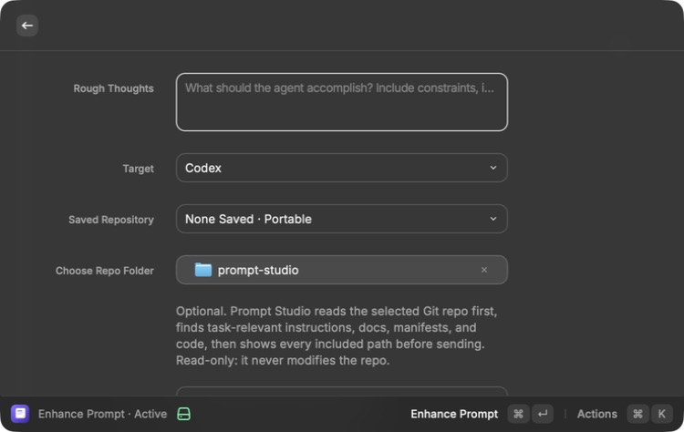
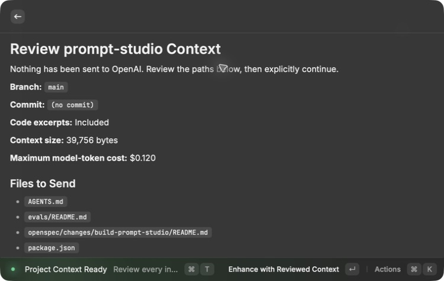
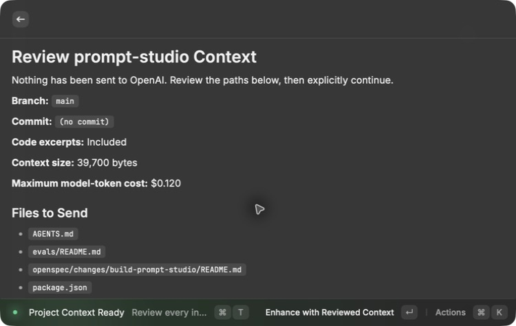
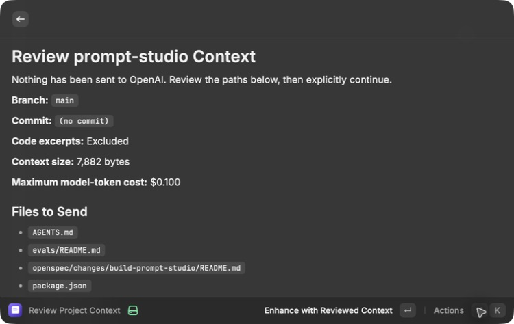

# Local project context — Activation 4

Status: **Active**

## Consequence

Prompt Studio can now personalize an enhancement from a selected Git project
without changing that project. Before any model request, the MacBook Pro shows
the exact repository facts and file excerpts that would be sent. The user can
remove all source code with one action and keep only instructions,
documentation, manifests, and Git facts.

The live verification found and fixed one important relevance problem:
Prompt Studio originally discarded a source file when the whole file exceeded
12 KB. In the real Prompt Studio repository, that removed the two files most
useful for reviewing Enhance Prompt. The collector now takes small,
line-numbered excerpts around the user's actual search terms. It marks skipped
gaps, scans the exact outgoing excerpt for secret-like values, and still
respects the 40 KB total limit.

## Active boundary

- Project roots are configured in Raycast and default to `~/Developer`.
- The enhancer also has a native folder picker for choosing one exact Git
  repository outside those roots. That one-run choice does not scan the
  repository's parent folders or silently add a new discovery root.
- Discovery does not scan elsewhere, follow directory symlinks, or descend into
  generated dependency and build directories.
- Collection uses filesystem reads plus read-only `git` and `rg` commands.
- Git runs with optional locks disabled.
- The bundle prioritizes applicable instructions, documentation, manifests,
  rough-thought matches, validation commands, branch, commit, and relevant
  uncommitted-change summaries.
- A safe UTF-8 source file up to 1 MB can contribute a query-matched excerpt of
  at most 10 KB. The excerpt keeps original line numbers and visible gap
  markers.
- Credential files, private keys, generated folders, binaries, symlinks,
  non-UTF-8 files, and outgoing text containing likely secrets are excluded.
- Absolute local paths are not sent to the model.
- Before a project-aware model request, Raycast shows every included path,
  repository state, omitted candidates, context size, and estimated maximum
  model-token cost.
- One action excludes relevant code excerpts while retaining repository
  metadata, instructions, documentation, and manifests.
- Saved project bindings retain project name, local path, branch, commit, and
  source paths. Browse Prompts compares the saved commit with the current
  commit and warns when the context may be stale.

## MacBook Pro rendered verification

The final enhancement form separates frequently discovered repositories from
one-run folder access:

- **Saved Repository** lists Git repositories found under configured roots;
- **Choose Repo Folder** opens the native macOS folder picker for one exact
  repository; and
- the form states that analysis is read-only, task-relevant, and reviewed
  before sending.

The real **Prompt Studio** repository was selected with this read-only request:

> Review Prompt Studio's Enhance Prompt implementation. Identify the smallest
> safe improvement, preserve existing behavior and user work, and show the
> exact project files used. Do not modify the repository.

The review screen showed:

- nothing had been sent to OpenAI;
- the selected branch was `main`;
- the reviewed bundle was about 39.7 KB;
- `src/enhance-prompt.tsx` and `src/core/enhancement.ts` appeared near the top
  as relevant source excerpts;
- every included path and omitted-file reason was visible; and
- the maximum model-token estimate was $0.120.

The **Exclude Project Code** action changed the same review to:

- code excerpts: Excluded;
- reviewed bundle: about 7.9 KB;
- maximum model-token estimate: $0.100; and
- only instructions, documentation, manifests, and repository facts retained.

No enhancement action was chosen, so this verification made no provider call,
created no cost, and transmitted no project data.

## No-mutation proof

Immediately before collection:

- Git-status hash:
  `033e9edbc3c6ba3be5ef7e426d0104ace8a391fcdf7c17c0cd989f6125e1b3c0`
- aggregate repository-content hash:
  `23ba2919dc8ed455c4baa551c37501c96841ce3203d785fa93a3ecdd3adacc27`

Immediately after both the included-code and excluded-code reviews, both hashes
were identical. Collection therefore left tracked, untracked, staged, and
working files unchanged.

## Automated evidence

The clean Mac Mini mirror passed:

- 51/51 tests;
- TypeScript;
- ESLint;
- the production Raycast build;
- the CLI and both MCP bundles plus their runtime checks;
- Prettier;
- strict OpenSpec validation; and
- a redacted Gitleaks scan over approximately 2.92 MB with no detected secrets.

The project-context integration test uses a real temporary Git repository. It
proves that:

- only repositories under the configured root are discovered;
- an outside repository is rejected;
- the same outside repository is accepted only when it is the exact folder the
  user explicitly selected;
- a nested folder is rejected because the repository root must be selected;
- relevant safe files and validation commands are selected;
- a source file larger than the old per-file limit contributes the matching
  lines instead of disappearing;
- a secret elsewhere in that large file is not included;
- an outgoing excerpt containing a likely secret is rejected;
- sensitive and generated material is absent from rendered context;
- the full bundle stays within its byte limit;
- code excerpts can be excluded;
- saved bindings and stale-commit detection remain valid;
- every repository file remains byte-for-byte identical; and
- Git status is identical before and after collection.

The existing OpenAI adapter test proves that only reviewed context is placed in
the request payload and that the absolute local repository path is absent. A
second paid enhancement was not needed to verify this local collection and
disclosure boundary.

## Activation decision

Activation 4 passed because the real MacBook Pro surface disclosed the selected
material, the code-exclusion control worked, the most relevant source files
were restored through bounded excerpts, no network request occurred, and both
repository hashes stayed unchanged. Context7 Research is now the next eligible
capability.
