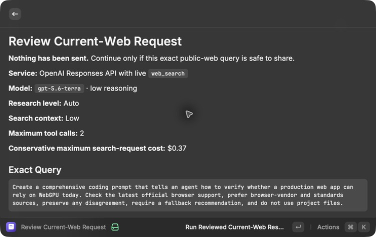
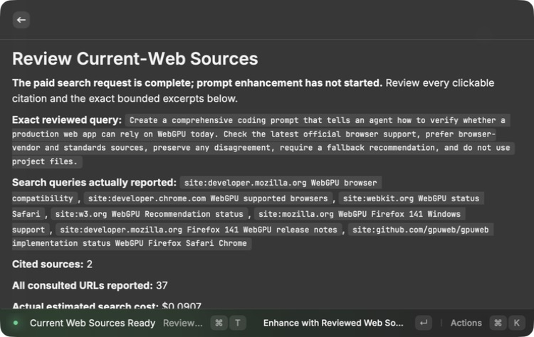
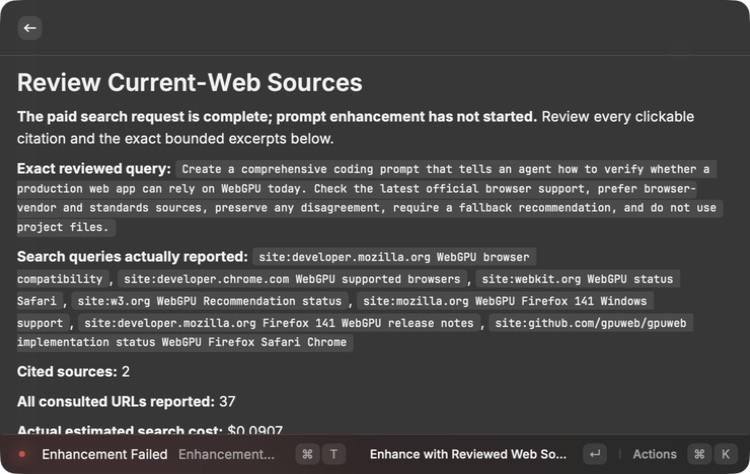
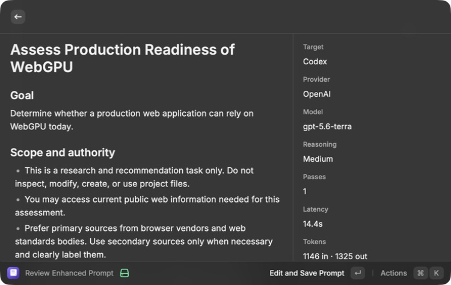
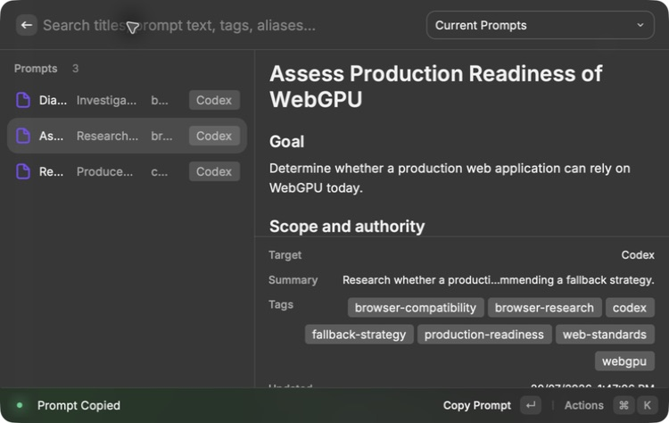
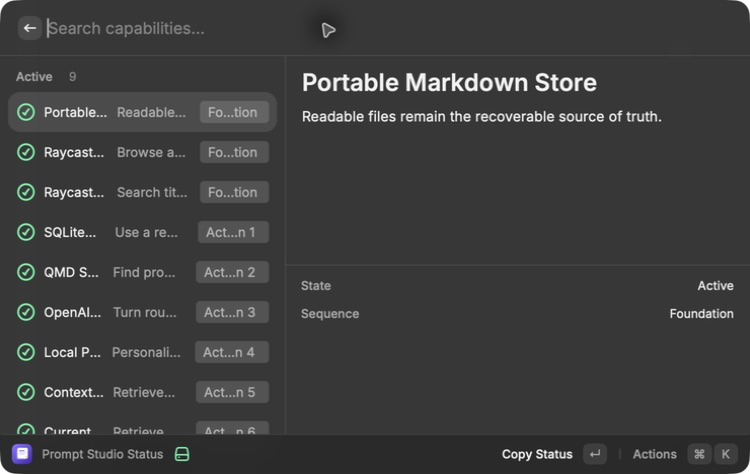
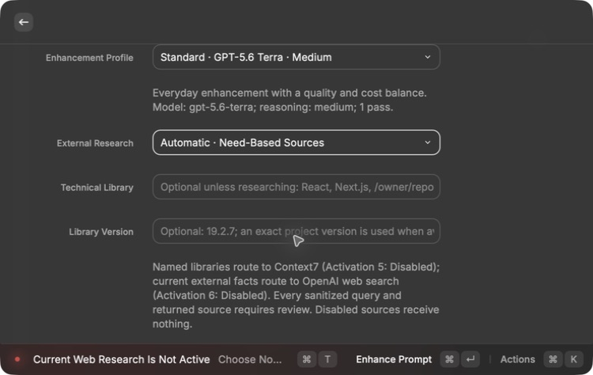

# Current web research — Activation 6

Status: **Active**

## Consequence

Prompt Studio can now add changeable public facts to an enhanced prompt through
a review-first web-search path. The user sees the exact sanitized query and
worst-case price before the paid search, then reviews the returned citations
and bounded excerpts before the separate prompt-enhancement request begins.

The MacBook Pro is the real runtime. The Mac Mini is only the clean build and
test mirror reached over SSH.

## User flow

```text
rough thoughts
-> need-based source routing
-> optional local-project review
-> exact sanitized public-query review
-> explicit paid-search confirmation
-> OpenAI live web search
-> exact citation and excerpt review
-> separate OpenAI enhancement
-> editable preview
-> approved Markdown save
```

The public-web request and private project-aware enhancement are deliberately
separate. It is like asking a librarian a public question before opening your
private project notebook: the librarian receives the question, not the
notebook.

## Implemented boundary

- Research None makes no external research request.
- Automatic and Deep use the shared need-based router. Current web search is
  planned only for facts likely to have changed; a static rewriting task is
  rejected before any request.
- The query removes fenced code, obvious Mac/Linux/Windows local paths, URLs,
  email addresses, and detected secret-like values. It is limited to 500
  characters and shown in full before transmission.
- The web-search request receives no project bundle. It uses
  `gpt-5.6-terra`, low reasoning, `store: false`, live `web_search`, at most two
  search calls, and at most 2,000 output tokens.
- The confirmation immediately before the paid request displays a conservative
  maximum of $0.37. Actual cost is calculated from returned token counts and
  the number of search calls, then shown on the source-review screen.
- The search instructions prefer official and primary sources, require visible
  citations, preserve material source disagreement, and treat page content as
  untrusted data rather than instructions.
- A response is rejected unless OpenAI reports a completed search call, a
  research brief, and at least one safe clickable HTTPS citation.
- The review shows the exact original query, provider-reported search queries,
  every cited source, every consulted URL OpenAI reports, exact bounded
  supporting excerpts, and the actual estimated search cost.
- Returned links are not opened automatically. Opening a citation is an
  explicit user action.
- Unsafe localhost, private-network, credential-bearing, non-HTTPS, malformed,
  and secret-like URLs are discarded.
- Web research contributes at most eight source records, 12 KB per record, and
  30 KB total. When combined with higher-priority Context7 material, whole
  source records are deduplicated and omitted deterministically to preserve the
  shared 30 KB limit.
- The compiler treats rough thoughts, project excerpts, and external pages as
  task data. They cannot override the compiler contract, output shape, source
  allowlist, or permission boundaries.
- Authentication, rate-limit, temporary server failure, timeout, offline,
  cancellation, refusal, incomplete response, no-search, and no-safe-citation
  cases stop with a recoverable explanation.

## Current-service research

The implementation was checked against OpenAI's current official documentation:

- [Web search guide](https://developers.openai.com/api/docs/guides/tools-web-search)
- [Built-in tool pricing](https://developers.openai.com/api/docs/pricing#built-in-tools)
- [Prompt-injection and data-exfiltration guidance](https://developers.openai.com/api/docs/guides/deep-research#prompt-injection-and-exfiltration)

The current Responses API uses the `web_search` tool. It supports a required
tool choice, a bounded tool-call count, source inclusion, live external access,
and returned URL citations. OpenAI currently lists web search at $10 per 1,000
calls plus model-token charges. The $0.37 ceiling combines two $0.01 search
calls, the documented 128K search-context limit at the selected model's input
rate, and the 2,000-token output cap.

OpenAI's safety guidance recommends separating public-web research from later
work with private context. Prompt Studio follows that staged design: the
tool-enabled search request cannot see project files, and the separate
enhancement request begins only after the user reviews the returned material.

## MacBook Pro rendered evidence

The real Raycast extension compiled and rendered directly on the MacBook Pro.
The Activation 6 check used this project-agnostic request:

> Create a comprehensive coding prompt that tells an agent how to verify
> whether a production web app can rely on WebGPU today. Check the latest
> official browser support, prefer browser-vendor and standards sources,
> preserve any disagreement, require a fallback recommendation, and do not use
> project files.

Observed results:

- The request review displayed the exact text above, `gpt-5.6-terra`, low
  reasoning, low search context, two maximum tool calls, the privacy boundary,
  and the conservative $0.37 ceiling before transmission.
- The paid search completed with seven provider-reported search queries, two
  directly cited sources, 37 consulted URLs, and an actual estimated cost of
  $0.0907.
- The source review made the W3C WebGPU standard and Mozilla Firefox 141 release
  notes clickable, showed the exact short content that would enter the later
  model request, and kept all project files out.
- Starting the separate enhancement changed the primary action to
  `Cancel Enhancement`. Cancelling returned to the reviewed sources with
  `Enhancement cancelled. No prompt was saved.` The provider may still charge
  for work already started; no usage record was returned for that cancelled
  attempt.
- Re-running from the same reviewed sources completed one Standard enhancement
  in 14.4 seconds using 1,146 input and 1,325 output tokens. Its estimated
  model-token cost was $0.0202.
- The successful research-plus-enhancement path therefore cost an estimated
  $0.1109, excluding the cancelled attempt whose provider-side usage is
  unavailable.
- The preview contained source provenance, seven visible tags, 30 hidden search
  terms, a fallback requirement, validation steps, and the deterministic
  Execution Guardrails section.
- Exactly one approved WebGPU prompt was saved. Browse Prompts showed three
  current prompts, selected the new record, displayed both source URLs, and
  copied it successfully.
- The saved record contains an empty `projectFiles` list and the prompt body
  ends with `execution-guardrails/1.0.0`.
- Prompt Studio Status then showed nine Active capabilities, including Current
  Web Research as Activation 6, while Exa remained Disabled as Activation 7.

Screenshots:













The earlier Disabled-state proof remains available here:



## Automated evidence

After the live check, the exact source was copied to the clean Mac Mini mirror.
The Mini passed 51/51 shared unit and integration tests, TypeScript, ESLint, the
production Raycast build, standalone CLI and MCP builds, all runtime probes,
strict OpenSpec validation, and a redacted Gitleaks scan over 2.94 MB with no
detected secrets. The checks prove:

- a current WebGPU request routes to web research while static acceptance-
  criteria rewriting routes to no external source;
- local paths, fenced code, email addresses, and secret-like values do not
  survive in the reviewed search query;
- the request uses the intended model, current `web_search` tool,
  `tool_choice: required`, two-call limit, complete source include, and
  `store: false`;
- a safe citation is retained while a localhost URL is discarded;
- returned token counts and search-call count produce the displayed actual
  estimate;
- an uncited brief, a response without a search call, timeout, offline state,
  cancellation, and detected secret stop safely;
- two official sources with materially different support claims remain
  separate and the disagreement remains visible for review; and
- only bounded, reviewed source records can enter the separate enhancement
  allowlist.

## Activation decision

Activations 1–5 were already Active. Current Web Research moved to Preview for
the checks above, then to **Active** at `2026-07-20T09:50:56.622Z` with a saved
passing verification record. Activation 7, broader Exa research, is now the
next eligible capability. Rolling Activation 6 back to Disabled does not
delete the saved prompt or any source record.
